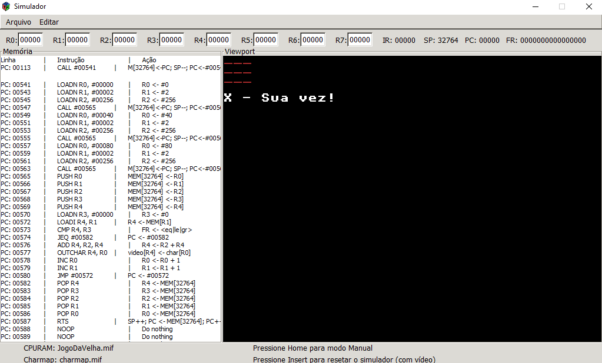
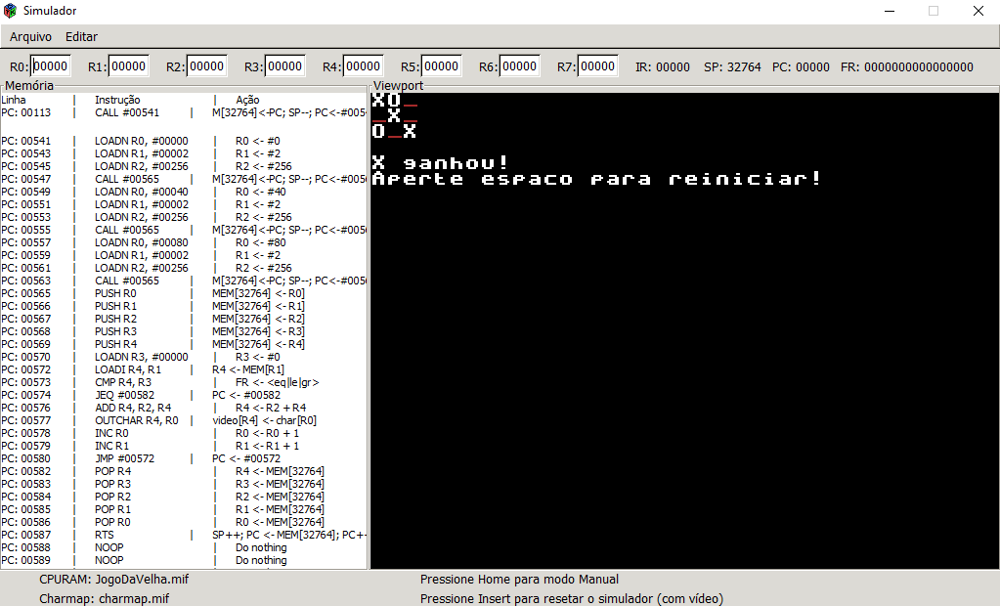
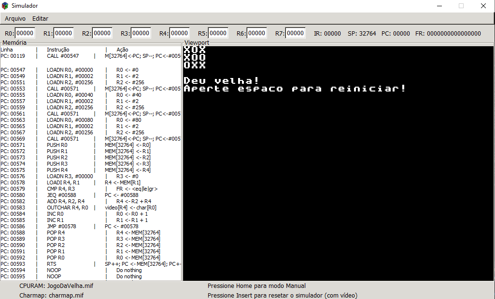

# JogoDaVelhaAssembly

Jogo da Velha feito em assembly para a disciplina de Prática em Organização de Computadores

## Como jogar
Pressione as teclas [1-9] referentes à posição no tabuleiro

1 | 2 | 3
4 | 5 | 6
7 | 8 | 9

### Professor: Eduardo do Valle Simões
### Aluno: Yvis Freire Silva Santos